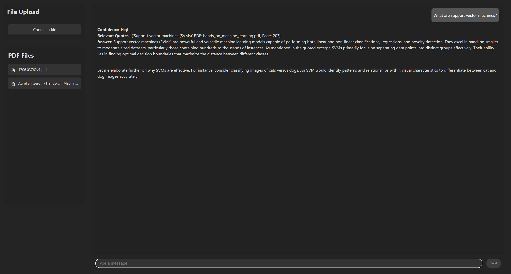
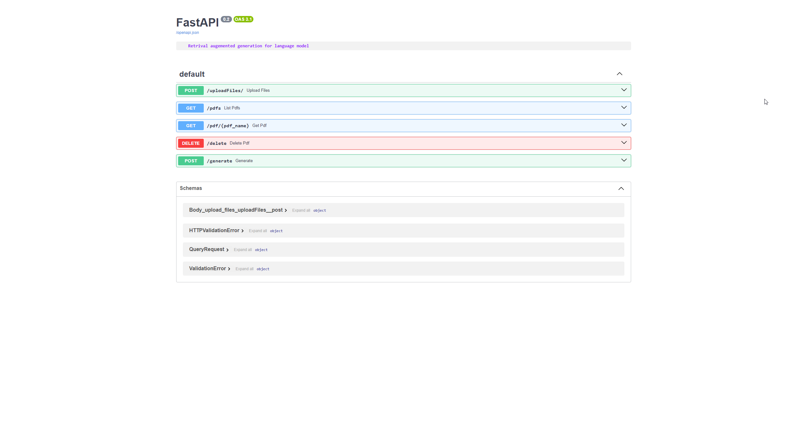

# Naive Retrival Augement Generation for Large Language Models
A simple Retrieval-Augmented Generation (RAG) system combining a Python **FastAPI** backend for natural language processing and a **Svelte** frontend for a modern, responsive user interface.


## Run Locally

Clone the project

```bash
  git clone https://github.com/SpyrosMitsis/local_rag_llm
```

Go to the backend directory
```bash
  cd backend
```

Intall backend dependencies
```bash
  pip install -r requirements.txt
```

Start backend
```bash
  python main.py
```

Go to the frontend directory
```bash
  cd frontend
```

Install frontend dependencies

```bash
  npm install
```

Start frontend server

```bash
  npm run dev
```


## Screenshots

### Frontend


### Backend


